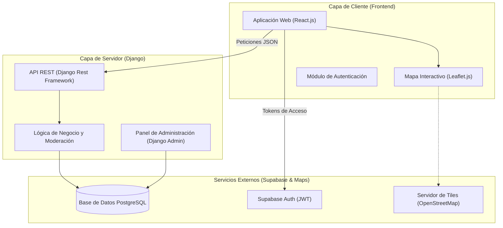

# 🏗️ Arquitectura del Sistema - Mapa Secreto

## 1. Diagrama de Componentes
El sistema utiliza una arquitectura **Headless (desacoplada)**, donde el frontend y el backend se comunican exclusivamente a través de una API REST.

## 2. Justificación Técnica de Componentes
* **Frontend:** React.js + Leaflet.js
React: Elegido por su capacidad para gestionar el estado de la interfaz de forma eficiente, permitiendo una experiencia de usuario fluida sin recargas de página.

Leaflet.js: Es una biblioteca ligera y flexible para mapas interactivos. Se prefiere sobre Google Maps por ser de código abierto y permitir el uso de capas de OpenStreetMap, lo que reduce costos y aumenta la privacidad.

* **Backend:** Django + Django Rest Framework (DRF)
Django: Proporciona un entorno robusto y seguro con un panel de administración integrado, lo que facilita enormemente la moderación de sugerencias requerida por el proyecto.

DRF: Permite exponer los datos de las tiendas y perfiles de forma estructurada (JSON), facilitando el consumo desde el frontend web y una futura app móvil.

Infraestructura: Supabase (PostgreSQL + Auth)
PostgreSQL: Motor de base de datos relacional indispensable para manejar datos geográficos y relaciones complejas entre usuarios y comercios.

Supabase Auth: Implementa estándares de seguridad ISO 27001, gestionando tokens JWT para que el servidor de Django reconozca a los colaboradores de forma segura.

## 3. Decisiones de Diseño
* **Escalabilidad:** Al estar desacoplado, el backend puede servir a múltiples clientes (Web, iOS, Android) simultáneamente.

* **Independencia:** El desarrollo del mapa y la lógica del servidor pueden avanzar por separado gracias al contrato de la API.